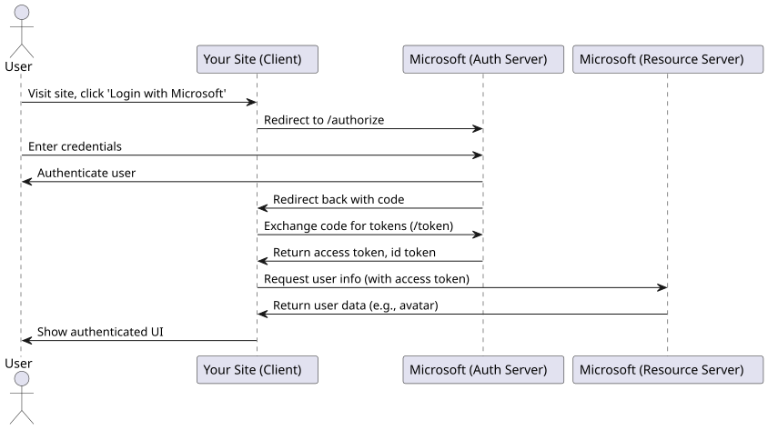

# Intro to OAuth2 & OpenID

## Scenario

Imagine you are building a website that requires user identity management. Instead of developing the entire user management flow yourself, you can leverage an existing identity provider, such as Microsoft, to handle authentication and user information.

By doing so, you save significant development effort (no need to build registration, login, 2FA, FIDO, etc.) and gain access to additional resources already associated with Microsoft accounts, such as user avatars.

### What is OpenID?

**OpenID Connect** allows your site to trust the identity of users authenticated by a third-party provider (e.g., Microsoft). This means your site can safely reuse a certified user identity without handling the authentication process directly.

### What is OAuth2?

**OAuth2** enables your site to obtain an access token from a third-party provider. With this token, your site can access protected resources (like a user's avatar) on behalf of the user, by calling the provider's APIs.

---

## How the Flow Works

1. **User visits your site** and chooses to log in with Microsoft.
2. **Your site redirects the user** to the Microsoft login page.
3. **User authenticates** with Microsoft (your site never sees the user's password).
4. **Microsoft redirects the user back** to your site, providing:
    - **Access Token**: Used to access protected resources (e.g., user profile, avatar).
    - **ID Token**: Used to verify the user's identity.
5. **Your site uses the tokens** to authenticate the user and, if needed, fetch additional data from Microsoft.

Your site never handles the user's credentials directly. Instead, it relies on Microsoft to authenticate the user and provide certified identity and access tokens.

---

## Sequence Diagram

---

## Summary

- **OpenID Connect**: For certified user identity (ID Token).
- **OAuth2**: For delegated access to user resources (Access Token).
- Your site delegates authentication and resource access to a trusted provider, improving security and user experience.
